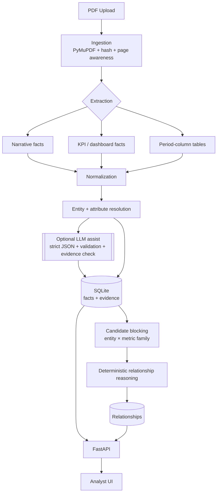
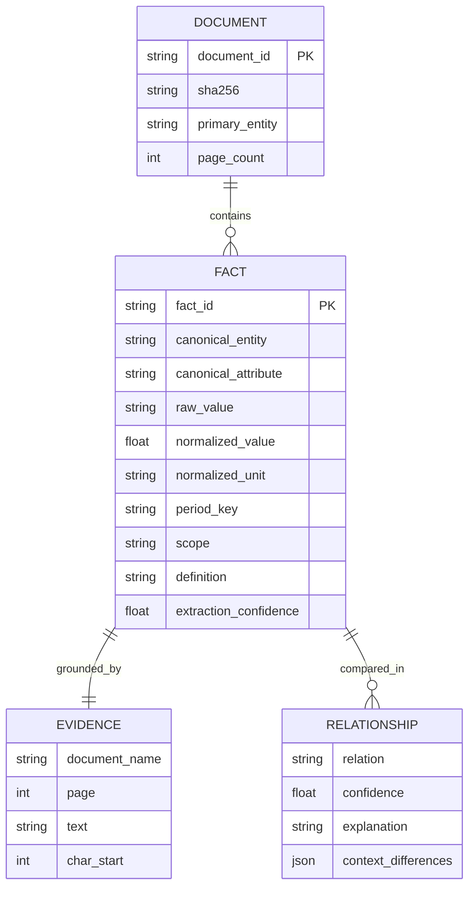

# Fact Knowledge Layer

> **Evidence-grounded fact extraction and cross-document reconciliation from PDFs.**
>
> Built for the **Superjoin Finance Engineering Intern assignment**.

The core problem is simple: important facts are scattered across financial and economic PDFs, expressed in different units and wording, and sometimes disagree. A useful system must do more than extract numbers — it must **prove where each fact came from, normalize it, compare it with other facts, and explain whether the documents corroborate, contradict, or differ because of context.**

The central object is the **fact**, not a chatbot.

---

## Table of contents

- [1. What it does](#1-what-it-does)
- [2. Why this is not simple extraction](#2-why-this-is-not-simple-extraction)
- [3. Architecture](#3-architecture)
- [4. Data model](#4-data-model)
- [5. Processing pipeline](#5-processing-pipeline)
- [6. Fact extraction](#6-fact-extraction)
- [7. Evidence grounding](#7-evidence-grounding)
- [8. Normalization](#8-normalization)
- [9. Entity resolution](#9-entity-resolution)
- [10. Candidate matching](#10-candidate-matching)
- [11. Relationship reasoning](#11-relationship-reasoning)
- [12. The four required cases](#12-the-four-required-cases)
- [13. Analyst UI](#13-analyst-ui)
- [14. API](#14-api)
- [15. Setup](#15-setup)
- [16. Running](#16-running)
- [17. Testing](#17-testing)
- [18. Evaluation](#18-evaluation)
- [19. Brownie points](#19-brownie-points)
- [20. Performance](#20-performance)
- [21. Security](#21-security)
- [22. Limitations](#22-limitations)
- [23. Next steps](#23-next-steps)
- [24. AI tools used](#24-ai-tools-used)
- [25. Engineering trade-offs](#25-engineering-trade-offs)
- [26. Demo](#26-demo)
- [27. Repository layout](#27-repository-layout)

---

## 1. What it does

Point the system at PDFs and it:

- reads documents page-by-page;
- extracts meaningful structured facts using a **general schema**;
- links every directly extracted fact to its **source document, page and evidence text**;
- normalizes units, currencies, dates and fiscal periods deterministically;
- resolves entities such as a company or country without hard-coded document facts;
- discovers candidate facts about the same metric across documents;
- classifies relationships as **corroborates, contradicts, contextually different, related-not-comparable, or uncertain**;
- stores the reasoning and evidence so an analyst can inspect *why* a relationship was produced.

On the six starter documents (511 pages), the implementation extracts roughly **2,300 evidence-grounded facts** and roughly **1,100+ cross-document relationships** in about **75 seconds with zero LLM calls**, while reproducing the four required assignment cases.

### Beyond the basic brief

The implementation also includes:

- visual evidence highlighting for individual facts;
- an intra-document accounting consistency checker;
- incremental ingestion and content-hash de-duplication;
- a hand-labelled evaluation harness with a confusion matrix;
- GitHub Actions CI;
- Docker support;
- failure/abstention handling rather than fabricated answers.

---

## 2. Why this is not simple extraction

Two documents can describe the same fact differently:

```text
₹8,142 Cr
        ↓ unit normalization
₹81,420 million
        ↓ rounding-aware comparison
Same underlying FY24 revenue
```

And two values with the same label can be genuinely non-comparable:

```text
86,184 team members — Dec 2021
63,713 team members — Mar 2024
        ↓
Different time + different footnote definition
        ↓
Contextually different, NOT automatically a contradiction
```

Therefore the system deliberately avoids the naive rule:

```python
if a.value != b.value:
    contradiction = True
```

Instead, it reasons over **value + unit + entity + attribute + period + scope + definition + status + confidence**.

---

## 3. Architecture

The design is **deterministic-first and LLM-optional**. Arithmetic, dates, normalization, candidate blocking and the final relationship rules are handled by code. An optional LLM assist exists for recall, but it is disabled by default and its outputs are evidence-validated.



### Stack

| Layer | Technology |
|---|---|
| Language | Python 3.11+ |
| API | FastAPI |
| Validation | Pydantic v2 |
| PDF processing | PyMuPDF |
| Storage | SQLite |
| Fuzzy matching | RapidFuzz |
| UI | Single-file HTML/CSS/JS |
| Optional LLM | Anthropic SDK |
| Testing | Pytest |
| CI | GitHub Actions |
| Packaging | Docker |

### Why not an LLM/vector/graph-heavy architecture?

The interesting engineering problem is not generating a paragraph of text. It is producing **auditable facts**.

- Arithmetic must be provable.
- Evidence must literally exist in the source.
- Structured entity/metric/period keys are excellent candidate-blocking signals.
- SQLite is sufficient for this knowledge layer and keeps the implementation simple.
- A graph database is not a substitute for fact discovery and reconciliation.
- A chatbot UI would hide the actual evidence and reasoning problem.

---

## 4. Data model

The central `Fact` is deliberately generic. `attribute` is a free string and `qualifiers` is open-ended, allowing new metrics to enter the knowledge layer without a document-specific schema change.



Important fact fields include entity and canonical entity, attribute and canonical attribute, raw and normalized values, currency and scale, period, as-of date, status, scope, definition, qualifiers, evidence, grounding type, extraction confidence and extraction method.

The implementation stores indexed columns plus a JSON representation, allowing the model to evolve without requiring a migration for every new metric.

---

## 5. Processing pipeline

```text
PDF
 ↓
Hash + de-duplicate
 ↓
Page-aware loading
 ↓
Entity detection
 ↓
Narrative / KPI / table extraction
 ↓
Validation + abstention
 ↓
Unit + date + period normalization
 ↓
Attribute / metric-family canonicalization
 ↓
Persist facts + evidence
 ↓
Incremental candidate generation
 ↓
Relationship classification
 ↓
Persist explanation + confidence
 ↓
API / analyst UI
```

Ingesting document **N** does not rebuild the entire knowledge layer. New facts are compared against relevant existing fact buckets only.

---

## 6. Fact extraction

The deterministic extractor uses three complementary strategies.

### Narrative extraction

Handles statements such as:

> revenue from operations on consolidated basis for FY24 stood at ₹81,415.38 million

The extractor reflows wrapped PDF lines, detects meaningful sentence boundaries, identifies the subject/value relationship and captures period, scope and status from surrounding context.

### KPI extraction

Handles presentation-style tiles such as:

```text
₹8,142 Cr
FY24 Revenue from Services
```

Strong numeric signals such as currency, scale and percentage markers are used to reduce chart/layout noise.

### Period-column tables

Financial tables often break generic PDF table extraction. The implementation therefore uses PDF text blocks, detects period headers and aligns row values using their geometric/text position. Scope such as standalone/consolidated is also captured from the surrounding header.

### Abstention

A value that cannot be parsed or grounded is **not invented**. It is dropped/flagged rather than converted into a hallucinated fact.

The optional LLM path is constrained by strict structured output, Pydantic validation and a literal evidence check: an LLM-produced value must be supported by text that actually appears on the source page.

---

## 7. Evidence grounding

Every directly extracted fact carries:

- source document;
- PDF page;
- printed page when detectable;
- section/chunk context;
- exact evidence text;
- character offsets;
- bounding box where available.

The sample dataset achieved **100% evidence grounding** in the evaluation run.

Grounding is explicitly separated into:

- `DIRECTLY_EXTRACTED` — literal source span;
- `INFERRED` — deterministic transformation such as unit normalization;
- `RECONCILED` — produced by cross-document reasoning.

This prevents an LLM explanation from being confused with source evidence.

### Visual evidence highlighting

`GET /facts/{id}/evidence.png` re-opens the source PDF, finds the evidence text on the relevant page and returns a rendered image with the evidence region highlighted.

That means an analyst can move from:

```text
Fact → Verdict → Explanation → Exact source page
```

rather than trusting a generated answer blindly.

---

## 8. Normalization

Normalization is deterministic and code-driven.

### Units and currency

The implementation handles common financial scales including crore/`Cr`, lakh, thousand/`K`, million/`Mn`, billion and percentages.

Raw values are retained while normalized values are used for comparison.

A **rounding-aware equivalence rule** allows a coarse reported number to corroborate a more precise number when the precise value rounds to the coarse value.

Example:

```text
₹8,142 Cr
≈ ₹81,415.38 million
```

while:

```text
6.4% ≠ 6.5%
```

### Time

The normalizer maps expressions such as `FY24`, `FY2024`, `2024-25`, `FY2024/25`, `Q4 FY24`, `year ended March 31, 2024`, `as of December 31, 2021` and `nine months ended ...` to canonical period representations where possible.

All arithmetic is performed by code. The LLM is never trusted to calculate normalization results.

---

## 9. Entity resolution

Entity resolution is designed to generalize rather than contain a list of assignment-specific names.

The system combines content signals and validated filename hints to identify the document's primary entity. Generic references such as `the Company` can then resolve to that entity.

On the starter dataset this identifies three Delhivery documents and three India macroeconomic documents.

---

## 10. Candidate matching

Facts are blocked using a structured key such as:

```text
(canonical_entity, canonical_metric_family)
```

Only relevant cross-document candidates are compared. A conservative RapidFuzz backstop handles close wording that deterministic canonicalization misses.

This provides two benefits:

1. fewer false comparisons between unrelated metrics;
2. incremental performance as the knowledge layer grows.

The system avoids blind O(n²) comparison across every fact.

---

## 11. Relationship reasoning

Relationship classification is an **ordered, auditable rule system**.

```text
1. Different entities
   → not related

2. Incompatible fact types
   → related-not-comparable

3. Period unknown
   → uncertain / abstain

4. Different periods
   → contextually different

5. Same period + equivalent normalized values
   → corroborates

6. Same period + different values + different scope/definition
   → contextually different

7. Same period + different values + no structural explanation
   → contradicts, if extraction confidence is sufficient

8. Otherwise
   → uncertain / abstain
```

Every relationship stores both fact references, both evidence references, verdict, confidence, context differences and a human-readable explanation.

---

## 12. The four required cases

All four cases are discovered from the documents rather than hard-coded into the UI.

### ① Corroboration — same fact, different units

**Delhivery FY24 revenue**

```text
Q4 FY24 presentation:  ₹8,142 Cr
Annual report:         ₹81,415.38 million
```

Verdict: **CORROBORATES**

Reason: same underlying metric and period; values reconcile after deterministic unit conversion and rounding-aware comparison.

### ② Genuine / likely contradiction — different estimate

**India FY25 real GDP growth**

```text
Economic Survey: 6.4%
RBI:              6.5%
```

Verdict: **CONTRADICTS**

Reason: same entity, period and metric, but different reported estimates. The system preserves the estimate-vintage context rather than declaring one source wrong.

The IMF also reports 6.5%, providing an additional corroborating source for the later figure.

### ③ Apparent contradiction — time and definition

**Delhivery team size**

```text
Prospectus, Dec 2021: 86,184
Q4 FY24 deck, Mar 2024: 63,713
```

Verdict: **CONTEXTUALLY DIFFERENT**

Reason: the values refer to different as-of dates and the footnote definitions differ. Equal labels do not imply equal measurement scope.

### ④ Failure found and fixed

Testing exposed a false contradiction between:

```text
Nominal GDP growth: 9.8%
Real GDP growth:     6.5%
```

The initial canonicalization treated `nominal` and `real` as filler and merged the metrics.

The fix keeps **nominal vs real growth as separate canonical metric families**. The benchmark was then re-run to verify that the false contradiction disappeared while the genuine 6.4% vs 6.5% case remained detectable.

Residual edge cases are documented under [Limitations](#22-limitations), with confidence gating and abstention used where the system cannot safely decide.

---

## 13. Analyst UI

The UI is intentionally an **analyst tool, not a chatbot**.

### Reconciliation

Ranks important relationships and shows both facts side-by-side with normalized values, source evidence, source pages, relationship verdict, confidence, explanation and contextual differences.

### Facts

Search and filter facts, open a fact, inspect its evidence and see related facts across documents.

### Documents

Upload PDFs through the UI and inspect processing statistics. New documents join the existing knowledge layer incrementally.

---

## 14. API

FastAPI exposes OpenAPI documentation at `/docs`.

| Endpoint | Purpose |
|---|---|
| `GET /health` | Health check |
| `GET /stats` | Knowledge-layer statistics |
| `GET /entities` | Entity list |
| `POST /documents/upload` | Upload and process PDF |
| `GET /documents` | List documents |
| `GET /documents/{id}` | Document details |
| `DELETE /documents/{id}` | Delete document and dependent data |
| `GET /documents/{id}/facts` | Facts from a document |
| `GET /facts` | Search/filter facts |
| `GET /facts/{id}` | Fact details |
| `GET /facts/{id}/relationships` | Related facts |
| `GET /facts/{id}/evidence.png` | Highlighted source evidence |
| `GET /relationships` | Relationship search/filter |
| `GET /consistency` | Intra-document accounting checks |
| `GET /search?q=` | General search |

Uploads are validated for PDF extension, PDF magic bytes, size limits and safe filenames.

---

## 15. Setup

Requires **Python 3.11+**.

```bash
python -m venv .venv
source .venv/bin/activate          # Linux/macOS
# .venv\Scripts\activate         # Windows

pip install -r requirements.txt
```

Optional configuration:

```bash
cp .env.example .env
```

No API key is required. The default system runs deterministically and offline.

### Environment variables

- `FACTLAYER_LLM_ENABLED` — default `false`
- `ANTHROPIC_API_KEY` — optional
- `FACTLAYER_LLM_MODEL` — optional
- `FACTLAYER_DB_PATH` — SQLite database location
- `FACTLAYER_UPLOAD_DIR` — PDF upload directory
- `FACTLAYER_MAX_UPLOAD_MB` — upload limit
- `FACTLAYER_REL_TOLERANCE` — relationship tolerance

---

## 16. Running

### Quick start

```bash
./run.sh
```

The script seeds the bundled sample documents and starts the application.

### Manual

```bash
python -m scripts.seed_samples --reset
uvicorn app.api:app --reload
```

Then open `http://127.0.0.1:8000`.

API documentation is available at `http://127.0.0.1:8000/docs`.

### Docker

```bash
docker build -t factlayer .
docker run -p 8000:8000 factlayer
```

After startup, upload additional PDFs from the **Documents** tab. They are processed into the same knowledge layer and compared incrementally against existing facts.

---

## 17. Testing

```bash
pytest -q
```

The test suite covers unit and currency normalization, fiscal-year alignment, entity and attribute normalization, relationship truth-table cases, extraction integration on real PDFs, evidence grounding, API upload/search/deduplication, malformed PDFs, blank/scanned pages, no-number text, duplicate document hashing and confidence/abstention behavior.

---

## 18. Evaluation

Run:

```bash
python -m eval.benchmark
```

or:

```bash
python -m eval.benchmark --report
```

The benchmark contains **hand-labelled expected relationships**. The labels live in the evaluation harness, not in the production reasoning code.

The evaluation reports per-case expected vs predicted verdicts, a confusion matrix, evidence-grounding rate, intra-document consistency checks, relationship distribution and high-confidence contradiction counts for regression tracking.

### Latest recorded sample evaluation

- **Evidence grounding:** 100%
- **Relationship classification:** 5/5 = 100% on labelled cases
- **Accounting identities:** 4/4 hold
- **High-confidence contradictions:** tracked to detect false-positive drift

The benchmark is intentionally small and should be treated as a **regression signal**, not as a population-level accuracy claim.

GitHub Actions runs the test/evaluation suite in CI.

---

## 19. Brownie points

### Large PDFs

Documents are processed page-by-page rather than sent as a single giant prompt. Text blocks are parsed locally and document timing is recorded.

### Many PDFs

All documents share one knowledge layer rather than creating isolated per-document results.

### Evolving schema

The generic attribute + qualifiers + JSON-backed representation allows new metrics to be stored without a schema migration.

### Incremental ingestion

Content hashing prevents duplicate ingestion, while candidate blocking means a newly added document is compared against relevant existing facts rather than rebuilding every relationship.

---

## 20. Performance

On the six starter documents:

```text
511 pages
~2,260–2,300 facts
~1,100–1,300 relationships
~75 seconds
0 LLM calls
```

Performance is recorded per document, including pages, facts, relationships, processing time and LLM calls.

Candidate blocking keeps comparison substantially below blind all-pairs comparison, while incremental ingestion avoids rebuilding the entire store.

---

## 21. Security

The repository is designed to keep secrets out of source control.

- `.env` is git-ignored; `.env.example` contains only configuration names.
- Uploads require `.pdf` and `%PDF` magic bytes.
- File size is bounded.
- Filenames are made path-traversal safe.
- Files are written only inside the configured upload directory.
- Malformed/encrypted PDFs fail gracefully.
- No arbitrary code execution is performed on uploaded documents.
- The LLM layer is disabled unless explicitly enabled.
- No credentials are required for the default offline workflow.

---

## 22. Limitations

### Extraction recall

Deterministic extraction intentionally favors precision. Unusually phrased facts may be missed.

### Metric granularity

Some sub-components and headline metrics can still be difficult to distinguish when documents use similar terminology. Confidence gating and abstention reduce the risk of presenting a false contradiction as fact.

### Comparative sentences

Statements such as `X% a year ago` can make period attribution ambiguous.

### Entity resolution

Content-based entity detection is heuristic and can be weaker for unnamed or highly generic documents.

### Complex tables

Common standalone/consolidated layouts are supported, but exotic multi-level headers may require stronger geometric table alignment.

### OCR

OCR is not bundled. Scanned pages are detected and skipped rather than silently producing unreliable text.

---

## 23. Next steps

- Enable the guarded LLM assist for low-recall pages.
- Introduce a learned metric canonicalizer for difficult granularity cases.
- Add OCR fallback for scanned PDFs.
- Improve geometric alignment for exotic tables.
- Add reviewer approval/rejection workflows.
- Feed confirmed reviewer decisions back into the evaluation benchmark.
- Expand the labelled evaluation set beyond the starter cases.

---

## 24. AI tools used

Development used **Claude (Cowork)** as a coding agent for architecture, implementation, debugging against the real PDFs, testing and documentation.

The product itself is **not dependent on an LLM at runtime**. Its default extraction and reasoning path is deterministic. The optional in-product LLM path uses the Anthropic SDK and is disabled unless explicitly configured with an API key.

---

## 25. Engineering trade-offs

| Decision | Why |
|---|---|
| Deterministic-first | Auditable arithmetic, evidence and dates; no hallucinated facts |
| LLM optional | Improves recall without making the system dependent on a model |
| SQLite + JSON | Simple, reliable and schema-evolving for this scale |
| Structured candidate blocking | Cheaper and more interpretable than blind vector search |
| Text-block table parsing | More reliable for the observed PDF layouts than generic table extraction |
| Precision over recall | In finance, an abstention is safer than an invented fact |
| Analyst UI over chatbot | Keeps evidence and reasoning visible |

See `DESIGN.md` for the detailed architecture and reasoning trade-offs.

---

## 26. Demo

Recommended ≤3-minute demo path:

1. Open **Reconciliation**.
2. Show **corroboration**: Delhivery ₹8,142 Cr vs ₹81,415.38 million.
3. Show **contradiction**: India real GDP 6.4% vs 6.5%, including estimate-vintage context.
4. Show **apparent contradiction**: team size 86,184 vs 63,713, explained by date and definition.
5. Open a fact and show its **source evidence**.
6. Upload a new PDF from **Documents** and show incremental processing.
7. Explain the **nominal-vs-real failure**, root cause and fix.

### Suggested opening

> Hi, I'm Nihal, and this is my solution for the Superjoin Engineering Intern assignment. The core problem I tried to solve is pretty simple: when important facts are spread across multiple PDFs, how do we automatically extract those facts, prove where they came from, and understand whether different documents actually agree or disagree? So I built a fact knowledge layer that does exactly that. Let me show you.

---

## 27. Repository layout

```text
fact-knowledge-layer/
├── app/
│   ├── extraction/
│   ├── ingestion/
│   ├── normalize/
│   ├── reasoning/
│   ├── services/
│   ├── static/
│   ├── api.py
│   ├── config.py
│   ├── db.py
│   └── models.py
├── docs/
├── eval/
├── sample_docs/
├── scripts/
├── tests/
├── .env.example
├── .gitignore
├── .github/
│   └── workflows/
│       └── ci.yml
├── DESIGN.md
├── Dockerfile
├── README.md
├── requirements.txt
└── run.sh
```

---

## Final principle

**A fact is only useful when you can answer four questions:**

```text
What is the fact?
       ↓
When / where / under what scope does it apply?
       ↓
Where is the evidence?
       ↓
What do other documents say — and why do they agree or disagree?
```

That is the purpose of the **Fact Knowledge Layer**.