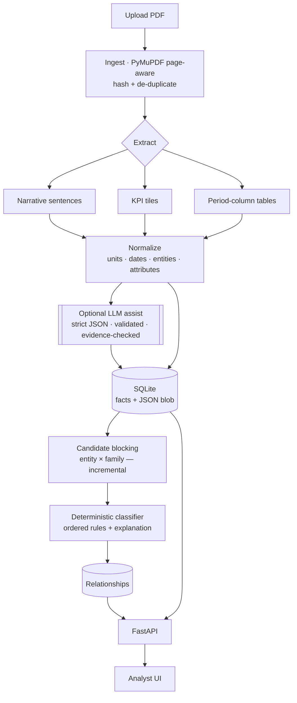
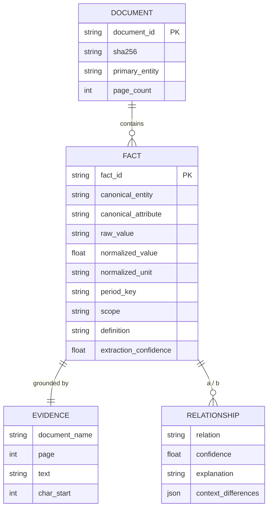
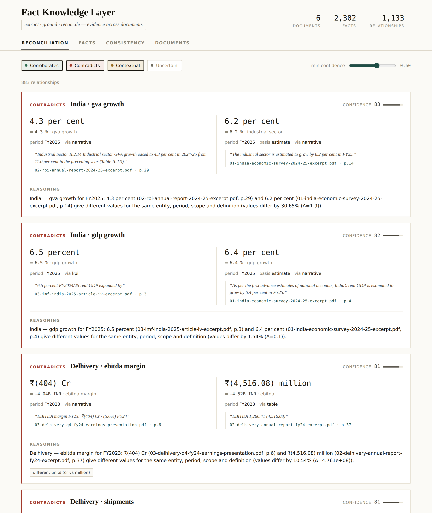

# Fact Knowledge Layer

Extract meaningful facts from PDFs, ground every fact in its source evidence, and
reconcile facts across documents — deciding when they **corroborate**,
**contradict**, or can be **reconciled through context** (time, scope, units,
definitions, estimate vintage).

Built for the Superjoin Finance Engineering assignment. It runs **fully offline**
with deterministic extraction and reasoning; an optional LLM layer can be enabled
with an API key but is never required.

> The central object is the **fact**, not a chat box. The interesting part is how
> facts are discovered, grounded, compared and explained.

---

## Table of contents

1. [Overview](#1-overview) · 2. [The problem](#2-the-problem) · 3. [The product](#3-the-product)
· 4. [Architecture](#4-architecture) · 5. [Data model](#5-data-model)
· 6. [Processing pipeline](#6-processing-pipeline) · 7. [Fact extraction](#7-fact-extraction)
· 8. [Evidence grounding](#8-evidence-grounding) · 9. [Normalization](#9-normalization)
· 10. [Entity resolution](#10-entity-resolution) · 11. [Candidate matching](#11-candidate-matching)
· 12. [Relationship reasoning](#12-relationship-reasoning) · 13. [The four required cases](#13-the-four-required-cases)
· 14. [UI](#14-ui) · 15. [API](#15-api) · 16. [Setup](#16-setup) · 17. [Running](#17-running)
· 18. [Testing](#18-testing) · 19. [Evaluation](#19-evaluation) · 20. [Brownie points](#20-brownie-points)
· 21. [Performance](#21-performance) · 22. [Security](#22-security) · 23. [Limitations](#23-limitations)
· 24. [Next steps](#24-next-steps) · 25. [AI tools used](#25-ai-tools-used)
· 26. [Engineering trade-offs](#26-engineering-trade-offs) · 27. [Demo](#27-demo-instructions)

---

## 1. Overview

Point the system at PDFs (financial filings, economic reports). It:

- reads them page-by-page and extracts structured **facts** with a general schema;
- links every directly-extracted fact to the **exact source text + page**;
- normalizes **units, currencies, dates and fiscal periods** with deterministic code;
- resolves **entities** ("Delhivery Limited" / "the Company" / "India") without hard-coded names;
- finds candidate facts about the same thing across documents and **classifies the relationship** with an explanation and a confidence.

On the six starter documents (511 pages) it extracts **~2,300 evidence-grounded
facts** and **~1,100 cross-document relationships** in **~75 seconds with zero LLM
calls**, and reproduces all four required cases.

**Beyond the brief** (see the noted sections): click any fact to see the **source
PDF page with the evidence highlighted** (§8); an **intra-document consistency
auditor** verifies accounting identities like `total income = revenue + other
income` from independently-extracted figures (§12b); and the evaluation produces a
**confusion matrix + written report**, gated in **GitHub Actions CI** (§19), with a
**Dockerfile** for one-command run (§17).

## 2. The problem

Facts are scattered, phrased differently, sometimes corroborated and sometimes
contradicted. Two traps make naive comparison wrong in both directions:

- `₹8,142 Cr` and `₹81,415.38 million` look different but are the **same** fact.
- `86,184` and `63,713` are both labelled "team size" but are **not comparable**
  (three years apart, different footnote definition).

So `if a.value != b.value: contradiction` is wrong. The product is the reasoning
between those traps. See `DESIGN.md` for the full plain-English write-up.

## 3. The product

An analyst tool with three surfaces (see [UI](#14-ui)): a **Reconciliation** view
(the cases, ranked), a **Facts** explorer (search/filter → open a fact → see
evidence + related facts), and a **Documents** view (upload + processing stats).
Everything answers: *what / who / when / what does it mean / where did it come
from / what does another document say / do they agree / if not, why / how
confident are we.*

## 4. Architecture

Deterministic-first, LLM-optional. Every value and page number is a literal span
from the source, so the core **cannot fabricate evidence**.



**Stack:** Python 3.11 · FastAPI · Pydantic v2 · PyMuPDF · SQLite · rapidfuzz ·
single-file HTML/JS UI. Optional: Anthropic SDK for the LLM layer.

Why not the "impressive" stack (LLM-extract-everything, vector DB, graph DB,
multi-agent, chat UI)? Because arithmetic/dates must be provable code, the
matching keys are structured (so a SQL block beats embeddings), a relational
store *is* the knowledge layer, and hallucinated evidence is the one failure
finance can't tolerate. Full reasoning in `DESIGN.md §3–4`.

## 5. Data model

The central `Fact` is deliberately **generic**: `attribute` is a free string and
`qualifiers` is open-ended, so a brand-new metric ("customer retention rate")
stores and compares with **no code or schema change**.



Key fields on every fact: entity + `canonical_entity`, attribute +
`canonical_attribute` (the comparability *family*), `raw_value` (verbatim) +
`normalized_value`/`normalized_unit` (code-derived), `currency`, `period`
(kind/label/fy_end_year/dates), `as_of_date`, `status` (actual/estimate/forecast/
revised), `scope`, `definition`, `qualifiers`, full `evidence`, `grounding`
(directly-extracted / inferred / reconciled), `extraction_confidence`,
`extraction_method`. Persisted as indexed columns + a JSON blob (`app/db.py`),
which is what lets the schema evolve without migrations.

## 6. Processing pipeline

`app/services/pipeline.py`: hash + de-duplicate → page-aware load → entity
detection → extraction (+ optional LLM) → persist facts → **incremental**
reasoning (new facts vs already-stored facts only) → persist relationships +
document stats. Ingesting document *N* never re-processes 1..*N*−1.

## 7. Fact extraction

Three complementary deterministic strategies (`app/extraction/`):

- **Narrative** (`deterministic.py`) — sentences like *"revenue from operations on
  consolidated basis for FY24 stood at ₹ 81,415.38 million"*. Reflows wrapped
  lines, splits on real sentence boundaries (never on the `.` inside `6.4`),
  takes the subject before the first linking verb, and reads period/scope/status
  from context. Richest source of period + scope.
- **KPI tiles** (`deterministic.py`) — dashboard values like *"₹8,142 Cr FY24
  revenue from services"*, reassembled across layout blocks; only *strong* values
  (currency/scale/percent) seed a tile, keeping chart noise out.
- **Period-column tables** (`tables.py`) — PyMuPDF's `find_tables` mangled these
  financial layouts, so we parse text **blocks** (which keep a row's label with
  its cells), detect column periods and scope (standalone/consolidated) from the
  header, and align cells **right-anchored** (newest value → newest period). This
  is what recovers the two team-size figures with their correct dates.

Values are parsed and validated; a fact with no parseable value is dropped
(**abstain**, never invent). The optional LLM layer (`llm.py`) is constrained to
strict JSON, Pydantic-validated, and its every value must quote text that
literally occurs on the page — otherwise discarded.

## 8. Evidence grounding

Every directly-extracted fact carries the exact supporting text, document name,
PDF page (and printed page when detectable), char offsets, and bbox where
available. The store's grounding rate on the sample set is **100%**. `grounding`
distinguishes **directly-extracted** (a literal span), **inferred** (code-derived,
e.g. normalized value) and **reconciled** (produced by cross-document reasoning),
so LLM-generated *explanation* is never confused with evidence.

**Evidence highlighting.** `GET /facts/{id}/evidence.png` re-opens the source PDF,
locates the evidence text on its page, and returns the page rendered with the
region **boxed in amber** (`app/services/render.py`). Clicking any fact in the UI
shows this image — grounding you can *see*.

## 9. Normalization

Deterministic and provable (`app/normalize/units.py`, `dates.py`):

- **Units/currency/scale** — crore, lakh, million, billion, thousand, %, `Cr`,
  `Mn`, `K`; monetary values normalized to a base currency amount, raw kept.
  Equivalence uses a **rounding-aware** rule: a coarse figure corroborates a
  precise one when the precise value *rounds to* the coarse one (so ₹8,142 Cr ≡
  ₹81,415.38 Mn), while 6.4% and 6.5% are correctly held apart.
- **Time** — `FY24`, `FY2024`, `2024-25`, `FY2024/25`, `Q4 FY24`, `year ended
  March 31, 2024`, `as of December 31, 2021`, `nine months ended …` all map to a
  canonical period (India FY ends 31 Mar), so `FY25` (Survey) = `2024-25` (RBI) =
  `FY2024/25` (IMF).

All arithmetic is code; the LLM is never used for it.

## 10. Entity resolution

`app/normalize/entities.py`, no hard-coded names. The document's primary entity is
detected from a validated file-name hint plus content signals (the legal-suffix
company that is also a frequent token → the reporting company; otherwise the
dominant proper noun → a country). Generic references ("the Company", "the Bank")
resolve to it. On the six documents this yields Delhivery ×3 and India ×3.

## 11. Candidate matching

`app/reasoning/candidates.py`. Facts are **blocked** by `(entity, family)` — a
cheap structured key — and only same-block, cross-document pairs are compared. A
conservative lexical back-stop (rapidfuzz, high threshold, same type) links close
wordings normalization missed. This avoids O(n²) blind comparison and is what
makes ingestion incremental.

## 12. Relationship reasoning

`app/reasoning/relationships.py`. **Ordered, auditable** rules — never
`if a.value != b.value`:

1. Different entity → not related. Incompatible types (percent vs money) →
   `related_not_comparable`.
2. Period unknown → tentative / abstain.
3. **Different period → `contextually_different`** (time explains it).
4. Same period, **values equivalent → `corroborates`** (reconciled across units).
5. Same period, values differ, **scope or definition differs → `contextually_different`**.
6. Same period, values differ, no structural reason → **`contradicts`** (with a
   vintage note when reporting basis differs), *but only if both extractions are
   confident enough* — otherwise **`uncertain`** (abstain).

Every relationship stores both facts, both evidences, the verdict, a confidence,
the context differences, and a human-readable **explanation** naming the dimension
that drove it.

## 12b. Intra-document consistency (the "auditor")

Beyond cross-document reconciliation, `app/reasoning/consistency.py` validates
**accounting identities within a document** — e.g. `total income = revenue + other
income` — for each (entity, period, scope), using only figures presented together
on the same statement page. A mismatch flags an extraction error or a genuine
inconsistency. On the sample set **4/4** identities hold exactly (e.g. consolidated
FY24: ₹81,415.38M + ₹4,526.96M = ₹85,942.34M). Identities are general financial
relationships (`IDENTITIES` config), not hard-coded facts. See the **Checks** tab
and `GET /consistency`. This is the feature that shows the system understands the
numbers, not just the strings.

## 13. The four required cases

All discovered by the system from the documents — none hard-coded. Reproduce with
`python -m eval.benchmark`.

**① Corroboration.** Delhivery FY24 revenue: **₹8,142 Cr** (Q4 deck, p.6) vs
**₹81,415.38 million** (annual report, p.36) → **CORROBORATES (0.89)**, "report the
same figure (within rounding tolerance), reconciled across different units."

**② Contradiction.** India FY25 real GDP growth: **6.4%** (Economic Survey, p.4) vs
**6.5%** (RBI, p.8) → **CONTRADICTS (0.71)** — same entity/period/scope/definition,
different values; flagged that the Survey figure is a first advance *estimate* and
RBI's is later (estimate vintage). *Bonus:* IMF 6.5% and RBI 6.5% **corroborate**,
so the view shows both the agreement and the Survey outlier.

**③ Apparent contradiction.** Delhivery team size: **86,184** as of Dec-2021
(prospectus, p.44) vs **63,713** as of Mar-2024 (Q4 deck, p.8) → **CONTEXTUALLY
DIFFERENT (0.98)** — different as-of dates *and* different footnote definitions
(the prospectus excludes daily-wage manpower + security guards; the deck also
excludes partner agents).

**④ A real failure found in testing.** During reasoning tests the system flagged
**"Nominal GDP growth 9.8% (IMF)"** as *contradicting* real GDP growth 6.5% — a
false contradiction, because normalization stripped *"nominal"/"real"* as filler
and merged two genuinely different metrics. **Handled:** `canonical_family` now
keeps *nominal* vs *real* growth in separate families; re-running the benchmark,
the false contradiction is gone and the real 6.4-vs-6.5 case is unaffected. A
residual, still-open version of this class (sub-component granularity and
comparative-sentence period attribution) is documented under
[Limitations](#23-limitations) — the system mitigates it with confidence gating
and abstention rather than hiding it.

## 14. UI




Single-file analyst UI (`app/static/index.html`), served by the API. Not a
chatbot. **Reconciliation** ranks relationships (contradiction & corroboration
first) with both facts side-by-side, each value's normalization, evidence
snippet + page, the verdict badge, confidence bar, and the "why". **Facts** is a
searchable/filterable table → click a fact to see its evidence and every related
fact across documents. **Documents** supports drag-and-drop upload with live
processing stats.

## 15. API

FastAPI (`app/api.py`), OpenAPI docs at `/docs`:

`GET /health` · `GET /stats` · `GET /entities` · `POST /documents/upload` ·
`GET /documents` · `GET /documents/{id}` · `DELETE /documents/{id}` (cascades to
its facts + relationships) · `GET /documents/{id}/facts` ·
`GET /facts` (filter entity/attribute/type) · `GET /facts/{id}` ·
`GET /facts/{id}/relationships` · `GET /facts/{id}/evidence.png` (highlighted page) ·
`GET /relationships` (filter relation/min-confidence) · `GET /consistency`
(accounting-identity checks) · `GET /search?q=`. Uploads are validated (`.pdf`
only, size limit, `%PDF` magic, path-traversal-safe filename).

## 16. Setup

```bash
cd factlayer
python -m venv .venv && source .venv/bin/activate     # optional
pip install -r requirements.txt
cp .env.example .env                                   # optional; runs fine without
```

Requires Python 3.11+. No API key needed — the system is deterministic by default.

**Environment variables** (`.env.example`): `FACTLAYER_LLM_ENABLED` (default
`false`), `ANTHROPIC_API_KEY`, `FACTLAYER_LLM_MODEL`, `FACTLAYER_DB_PATH`,
`FACTLAYER_UPLOAD_DIR`, `FACTLAYER_MAX_UPLOAD_MB`, `FACTLAYER_REL_TOLERANCE`.

## 17. Running

```bash
./run.sh                       # seeds the bundled sample PDFs, then serves UI+API
# or manually:
python -m scripts.seed_samples --reset      # ingest sample_docs/ (optional)
uvicorn app.api:app --reload
# or with Docker (seeds at build time, demo-ready):
docker build -t factlayer . && docker run -p 8000:8000 factlayer
```

Open <http://127.0.0.1:8000> for the UI, <http://127.0.0.1:8000/docs> for the API.
Upload your own PDFs from the **Documents** tab — they enter the same knowledge
layer and are compared incrementally against everything already ingested.

## 18. Testing

```bash
pytest -q          # 45 tests: units, dates, entities, attributes, reasoning,
                   # extraction integration, API, and failure/robustness paths
```

Covers normalization arithmetic, fiscal-year alignment, the classifier's full
truth table (corroborate/contradict/contextual/uncertain/scope/type), real-PDF
extraction (team size + revenue with correct scaling and evidence), the API flow
(upload → dedup → search), and failure paths (malformed PDF, blank/scanned pages,
text without numbers → abstains, duplicate hashing).

## 19. Evaluation

```bash
python -m eval.benchmark            # prints the report
python -m eval.benchmark --report   # also writes eval/REPORT.md
```

A small, **hand-labelled** benchmark (`eval/benchmark_cases.json`) with expected
verdicts — labels live in the eval, never in the system. The harness emits a
per-case table, a **confusion matrix (expected → predicted)**, the consistency
result, and the store's relationship distribution (`eval/REPORT.md`). Latest run:

- **Evidence grounding: 100%** (every fact has evidence text + an in-range page)
- **Relationship classification: 5/5 = 100%** on the labelled cases (clean diagonal confusion matrix)
- **Intra-document consistency: 4/4** accounting identities hold
- **High-confidence contradictions in store: 8** (tracked to catch false-positive drift)

The benchmark is deliberately small; treat the numbers as a **regression signal**,
not a population estimate. It runs in **GitHub Actions CI** (`.github/workflows/ci.yml`)
alongside the test suite, so a regression fails the build.

## 20. Brownie points

- **Large PDFs** — page-by-page processing, never whole-document prompting; text
  blocks parsed locally; per-document timing recorded.
- **Many PDFs** — one shared knowledge layer; new documents join the same store.
- **Evolving fact schema** — generic attribute + open `qualifiers` + JSON storage;
  a new metric needs no migration (demonstrated: inflation sub-metrics, team size,
  tonnage all coexist with revenue and GDP).
- **Incremental ingestion** — content-hash de-duplication; a new document's facts
  are compared only against existing facts (the seed log shows relationships grow
  document-by-document, first Delhivery doc → 0, later docs → hundreds).

## 21. Performance

Six documents / 511 pages → ~2,260 facts + ~1,300 relationships in **~75 s, 0 LLM
calls** on a laptop-class machine. Recorded per document: pages, facts,
relationships, processing time, LLM calls. Candidate blocking keeps comparison
sub-quadratic; incremental ingestion means adding a document does not rebuild the
store.

## 22. Security

`.env` for secrets (git-ignored) with `.env.example` committed; no credentials in
the repo. Upload validation: extension + `%PDF` magic-byte check, size limit,
path-traversal-safe filenames written only inside the configured upload dir.
Encrypted/malformed PDFs fail gracefully (document marked `failed`, no crash). No
arbitrary code execution; the LLM path is off unless explicitly enabled.

## 23. Limitations

- **Deterministic extraction trades recall for precision** — oddly-phrased facts
  can be missed (the optional LLM layer targets exactly this).
- **Residual reasoning noise** — a handful of high-confidence contradictions come
  from metric-granularity collisions (revenue sub-lines, sector vs headline
  growth) and comparative-sentence period attribution ("X% a year ago"). Mitigated
  by confidence gating, scope/definition checks and abstention; not fully solved.
- **Entity resolution is heuristic** — strong on descriptively-named files;
  content-only detection on an unnamed corporate deck can pick a salient noun.
- **Table scope** covers the common standalone/consolidated split; exotic
  multi-level headers may under-tag scope.
- **OCR** is not bundled — scanned pages are detected and skipped (abstain), not
  transcribed.

## 24. Next steps

Turn on the LLM assist for low-recall pages (guardrails already built); a small
learned metric-canonicalizer to cut granularity collisions; OCR fallback for
scanned pages; per-column geometric table alignment for exotic layouts; a
reviewer workflow to confirm/reject relationships and feed the benchmark.

## 25. AI tools used

Built with **Claude (Cowork)** as the coding agent — architecture, implementation,
iterative debugging against the real PDFs, tests and docs. The *product itself*
uses **no LLM at runtime by default**; the optional in-product LLM layer targets
Anthropic Claude via the official SDK and is disabled unless a key is provided.

## 26. Engineering trade-offs

Deterministic-first over LLM-first (no hallucinated evidence, provable
arithmetic, zero cost/offline) · SQLite + JSON over a graph/vector DB (simple,
reliable, schema-evolving, explainable) · block-based table parsing over
`find_tables` (chosen after measuring both on the actual documents) · precision
over recall in both extraction and reasoning (abstain when unsure) · a focused
analyst UI over a chatbot. See `DESIGN.md` for the full first-plan → critique →
final-architecture trail.

## 27. Demo instructions

`./run.sh`, open the UI, and follow this ≤3-minute path:

1. **Reconciliation** tab — the ranked cases are on screen.
2. **Corroboration** — Delhivery revenue ₹8,142 Cr ≡ ₹81,415.38 million (units reconciled).
3. **Contradiction** — India GDP 6.4% (Survey) vs 6.5% (RBI/IMF), vintage-flagged.
4. **Apparent contradiction** — team size 86,184 vs 63,713, explained by date + definition.
5. **Facts** tab — search a metric, open a fact, show its evidence + related facts.
6. **Documents** tab — drag in a new PDF; watch facts + relationships grow incrementally.
7. **Failure** — the nominal-vs-real GDP case in §13④ (found, root-caused, fixed).

Repo layout: `app/` (ingestion · extraction · normalize · reasoning · services ·
api · static), `tests/`, `eval/`, `scripts/`, `sample_docs/`, `DESIGN.md`.
